# Project Description
Project 3

# Home Page
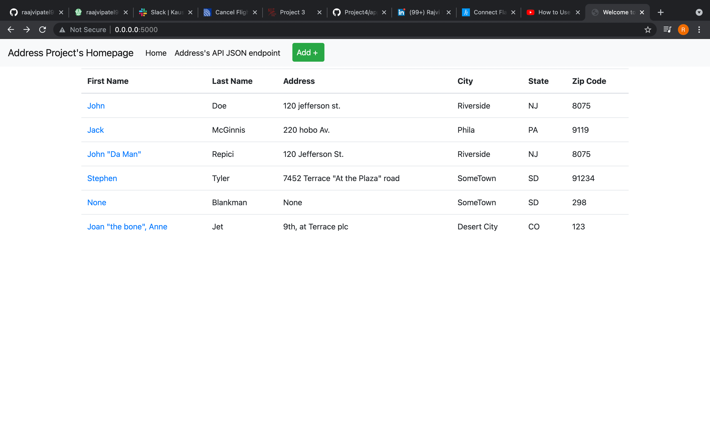

# Add (Webpage)
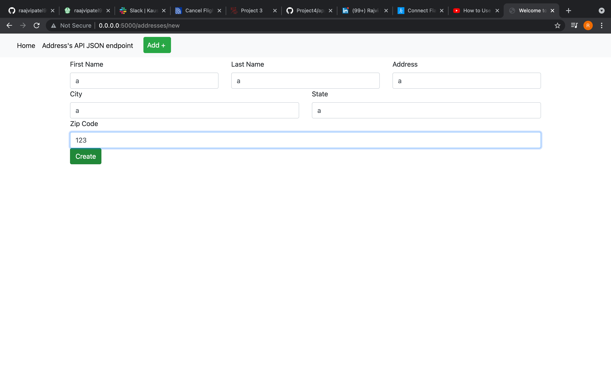

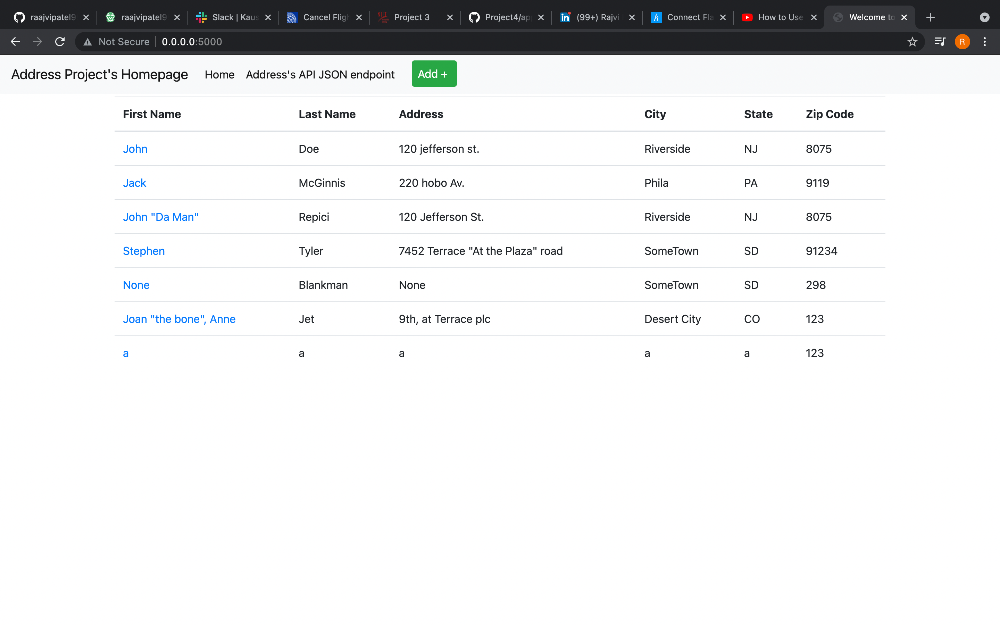

# Edit (Webpage)
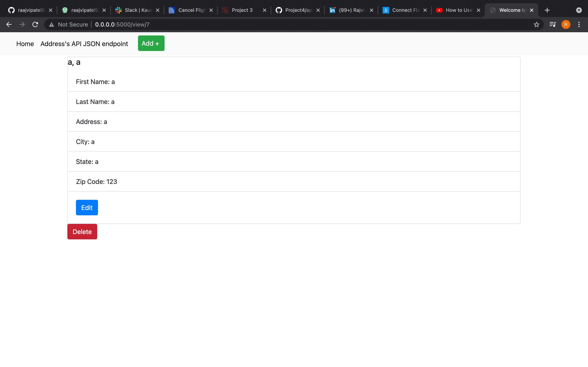

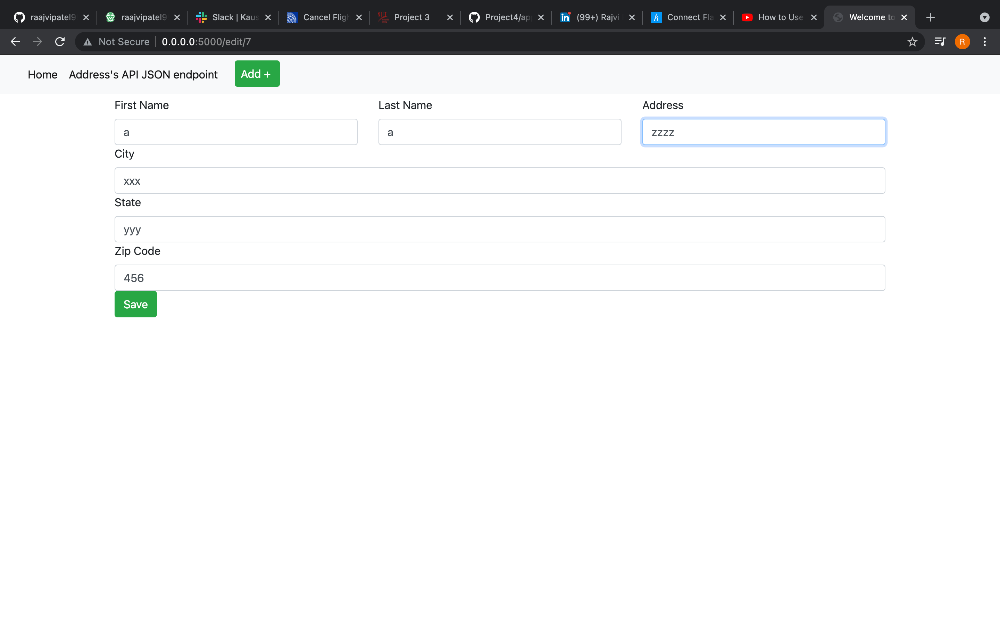

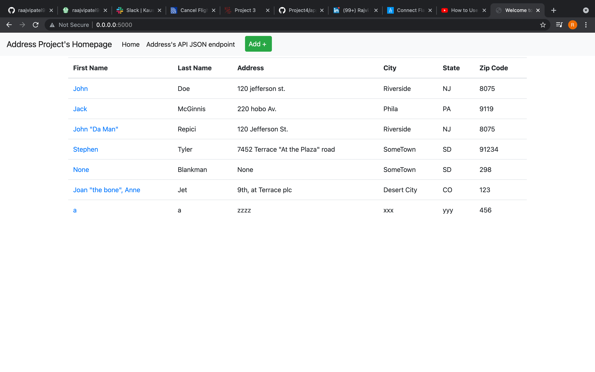

# Delete (Webpage)
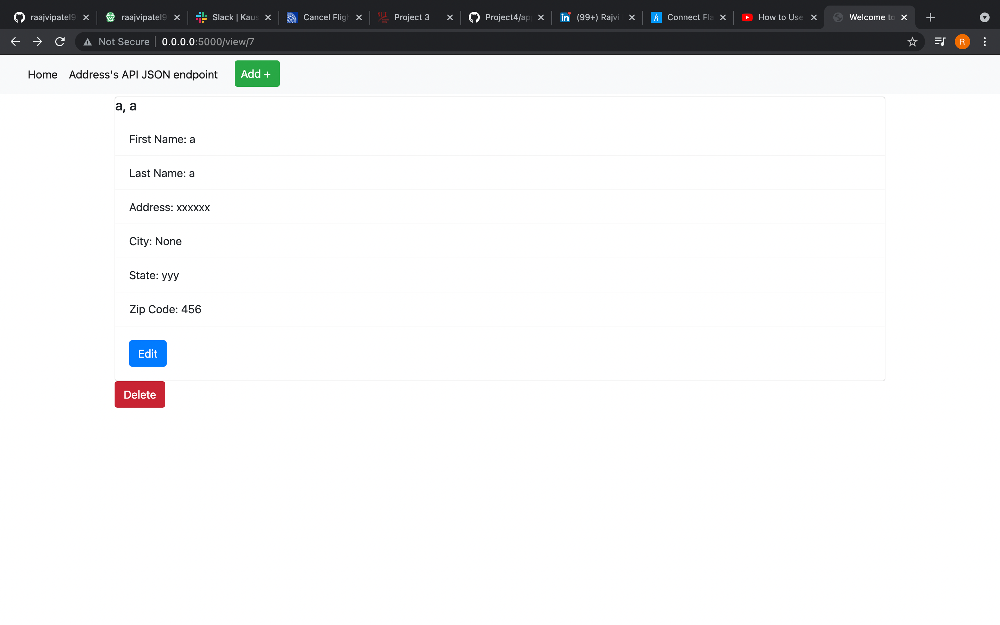

# GET Request (Postman)
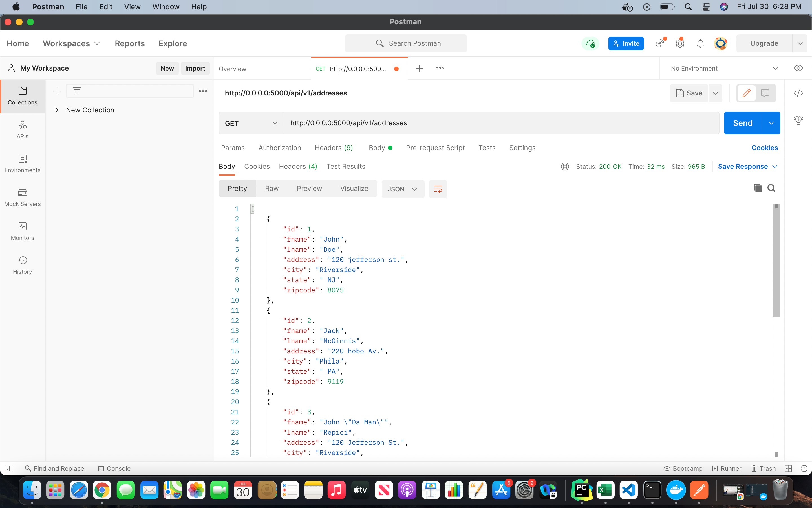

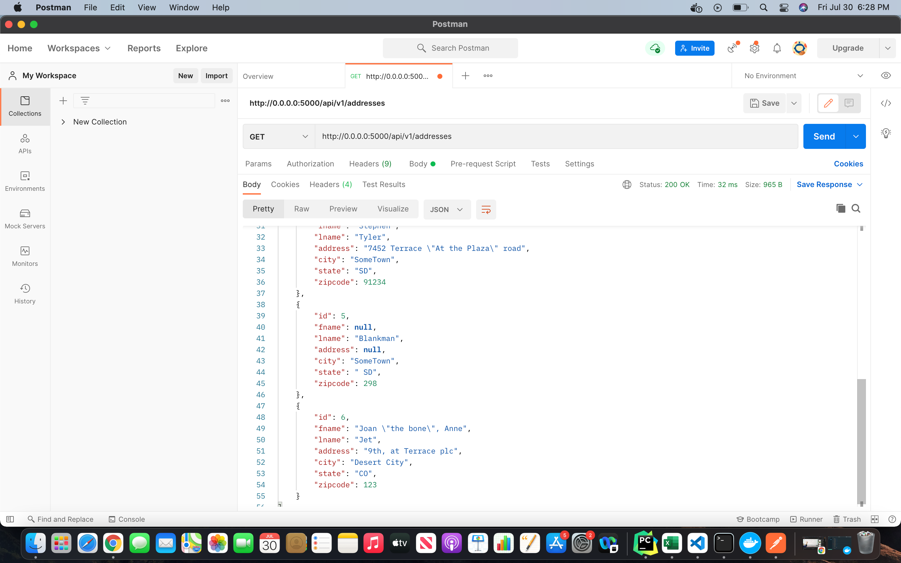

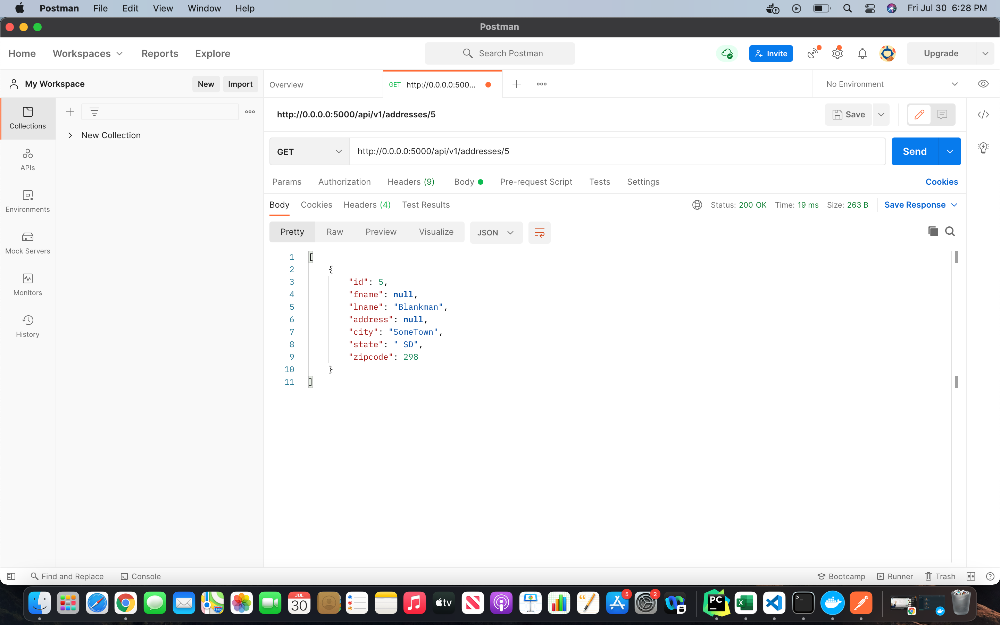

# POST Request (Postman)
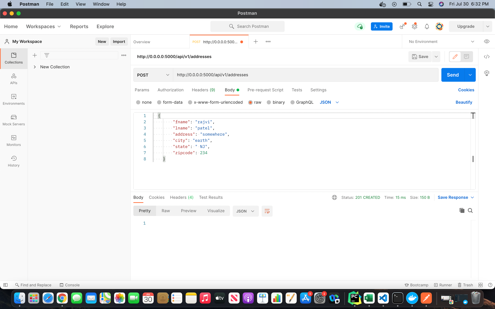

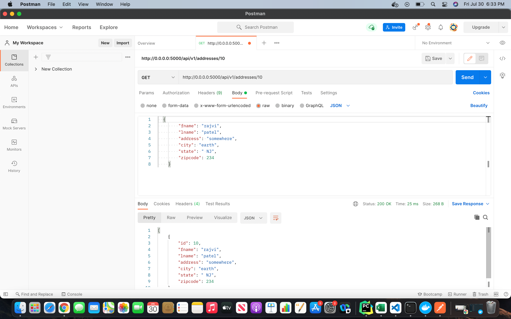

# PUT Request (Postman)
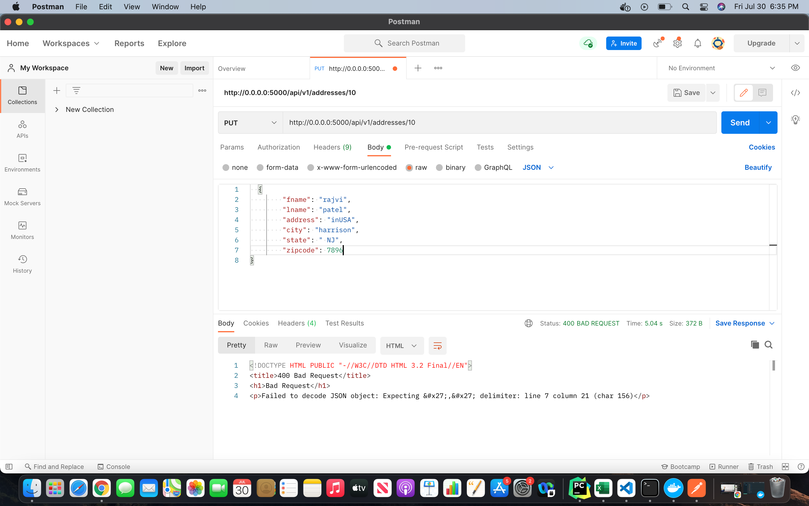

# DELETE Request (Postman)
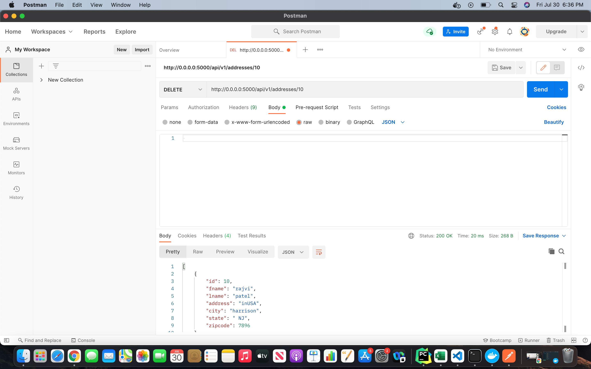

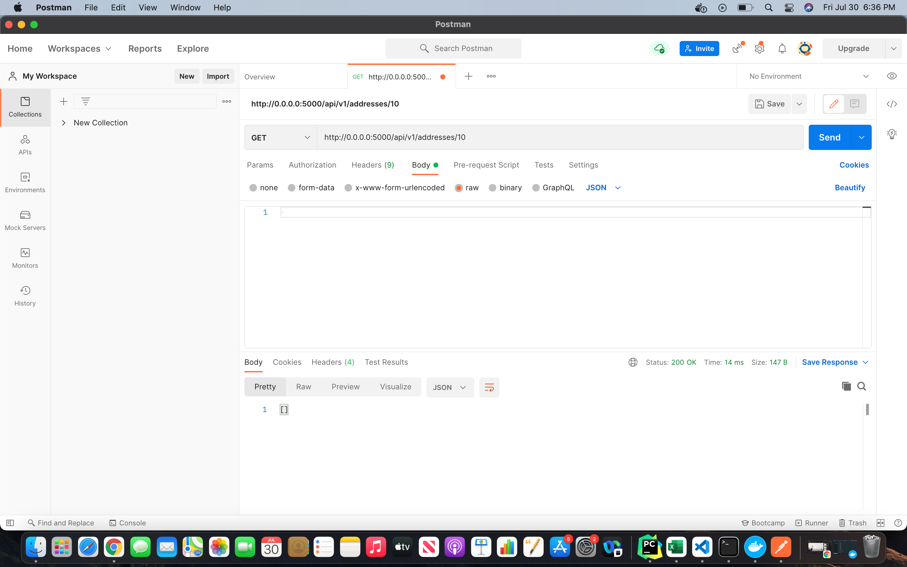

